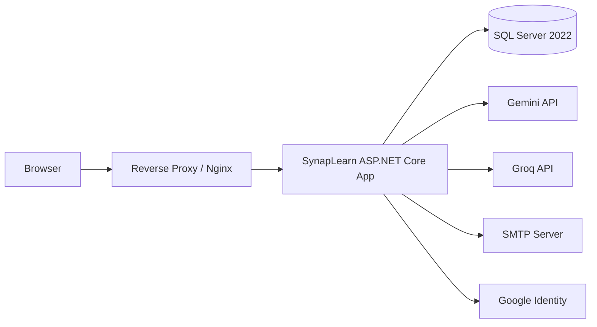

<div align="center">
  <h1>SynapLearn</h1>
  <p><strong>Nền tảng học tập thông minh giúp biến tài liệu thành quy trình ôn tập có cấu trúc</strong></p>
  <p>ASP.NET Core 9 • SQL Server • Docker • Gemini/Groq • JWT • xUnit</p>
</div>

SynapLearn là một nền tảng học tập ứng dụng AI, cho phép người dùng tải tài liệu, nhập văn bản, dùng URL hoặc video để tạo bản tóm tắt, ý chính, quiz và dữ liệu theo dõi tiến độ học tập. Dự án được xây dựng theo mô hình backend ASP.NET Core kết hợp giao diện tĩnh trong `wwwroot`, dùng SQL Server làm cơ sở dữ liệu chính và được tối ưu để triển khai bằng Docker trên VPS của AWS.

## Mục lục

- [1. Tổng quan](#1-tổng-quan)
- [2. Điểm nổi bật](#2-điểm-nổi-bật)
- [3. Kiến trúc hệ thống](#3-kiến-trúc-hệ-thống)
- [4. Công nghệ sử dụng](#4-công-nghệ-sử-dụng)
- [5. Tính năng chính](#5-tính-năng-chính)
- [6. Bản đồ trang và API](#6-bản-đồ-trang-và-api)
- [7. Cấu trúc thư mục](#7-cấu-trúc-thư-mục)
- [8. Yêu cầu môi trường](#8-yêu-cầu-môi-trường)
- [9. Chạy nhanh bằng Docker](#9-chạy-nhanh-bằng-docker)
- [10. Chạy local bằng .NET](#10-chạy-local-bằng-net)
- [11. Cấu hình môi trường](#11-cấu-hình-môi-trường)
- [12. Database và migrations](#12-database-và-migrations)
- [13. Testing](#13-testing)
- [14. Deploy trên AWS VPS](#14-deploy-trên-aws-vps)
- [15. Vận hành và troubleshooting](#15-vận-hành-và-troubleshooting)
- [16. Bảo mật](#16-bảo-mật)
- [17. Roadmap](#17-roadmap)

## 1. Tổng quan

SynapLearn tập trung vào một luồng học tập rõ ràng:

1. Tiếp nhận nội dung học tập từ file, văn bản hoặc URL.
2. Dùng AI để tóm tắt, trích ý chính, chuẩn hóa nội dung.
3. Tạo quiz hoặc flashcard từ nội dung đã xử lý.
4. Lưu lịch sử, phân tích kết quả và hỗ trợ quản trị vận hành.

Hệ thống hỗ trợ cả người dùng đăng nhập và người dùng guest. Guest có thể trải nghiệm nhanh một lượt, còn người dùng đăng nhập sẽ có đầy đủ lịch sử học tập, dashboard và khu vực quản trị theo vai trò.

## 2. Điểm nổi bật

- Hỗ trợ nhiều nguồn đầu vào: text, URL, YouTube, PDF, DOCX, ảnh và video.
- Tự động tóm tắt nội dung và trích các ý chính bằng AI.
- Sinh quiz trắc nghiệm hoặc flashcard với nhiều mức độ khó.
- Hỗ trợ đăng nhập thường, Google Login và xác thực email bằng OTP.
- Có dashboard học tập, analytics, lịch sử nội dung và hồ sơ người dùng.
- Có khu vực admin để quản lý người dùng, nội dung, AI logs, moderation và cài đặt hệ thống.
- Có cơ chế content moderation và AI safety review trước khi nội dung được dùng sâu hơn.
- Tự động migrate database khi ứng dụng khởi động.
- Đã chuẩn hóa để deploy bằng Docker trên AWS VPS với SQL Server.

## 3. Kiến trúc hệ thống



### Luồng xử lý chính

- Frontend được phục vụ trực tiếp từ `wwwroot` và `PrivatePages`.
- Backend ASP.NET Core cung cấp API cho auth, summary, quiz, dashboard, content và admin.
- EF Core kết nối SQL Server để lưu user, content, quiz, attempts, moderation, logs và settings.
- AI routing có thể chọn Gemini hoặc Groq, có fallback khi provider lỗi hoặc chậm.
- Khi deploy trên VPS, ứng dụng chạy trong container và SQL Server chạy trong container riêng, kết nối qua Docker network nội bộ.

## 4. Công nghệ sử dụng

| Thành phần | Công nghệ |
| --- | --- |
| Backend | ASP.NET Core 9 |
| ORM | Entity Framework Core 9 |
| Database | SQL Server 2022 |
| Authentication | JWT Bearer + auth cookie |
| Social Login | Google Sign-In |
| OTP | SMTP email OTP |
| AI Providers | Gemini, Groq |
| PDF Processing | UglyToad.PdfPig |
| Video Audio Extraction | ffmpeg |
| Frontend | HTML, CSS, JavaScript |
| Test | xUnit, EF Core InMemory |
| Containerization | Docker, Docker Compose |

## 5. Tính năng chính

### 5.1. Xử lý nội dung học tập

- Upload file tối đa 100MB.
- Hỗ trợ các định dạng văn bản như `txt`, `md`, `csv`, `json`, `xml`, `html`.
- Hỗ trợ `pdf` và `docx`.
- Hỗ trợ ảnh như `jpg`, `jpeg`, `png`, `bmp`, `gif`, `webp`.
- Hỗ trợ video như `mp4`, `mov`, `avi`, `mkv`, `webm`, `m4v`.
- Hỗ trợ tóm tắt từ URL HTTP/HTTPS.
- Hỗ trợ phân tích YouTube URL bằng cách lấy metadata và transcript khi có thể.

### 5.2. AI summary và quiz generation

- Tạo bản tóm tắt và danh sách ý chính.
- Dùng vision model cho nội dung ảnh khi cần.
- Dùng transcription cho video thông qua `ffmpeg` và AI provider.
- Tạo quiz theo độ khó `easy`, `medium`, `hard`.
- Hỗ trợ loại quiz `multiple-choice` và `flashcard`.
- Có cơ chế fallback giữa Gemini và Groq.
- Có cache phản hồi AI và health-based provider switching.

### 5.3. Auth và người dùng

- Đăng ký tài khoản.
- Đăng nhập bằng email/password.
- Đăng nhập bằng Google.
- Xác thực email bằng OTP.
- Lưu token qua cookie xác thực.
- Hồ sơ người dùng, đổi thông tin cá nhân, thông báo hệ thống.

### 5.4. Học tập và theo dõi tiến độ

- Lưu lịch sử nội dung đã xử lý.
- Xem chi tiết từng content.
- Làm bài quiz và nộp bài.
- Dashboard tổng quan học tập.
- Trang analytics và learning plan.

### 5.5. Quản trị

- Dashboard vận hành tổng quan.
- Quản lý user, tài khoản admin và phân quyền.
- Quản lý contents và moderation status.
- Xem AI logs, audit logs và cảnh báo.
- Cấu hình runtime cho AI routing và vận hành hệ thống.
- Quản lý notification cho người dùng.

### 5.6. Quy tắc guest

- Guest chỉ được dùng thử giới hạn một lượt cho luồng summary/quiz/chấm điểm.
- Sau giới hạn này, người dùng cần đăng nhập để tiếp tục.
- Guest session được theo dõi bằng token, IP và user-agent.

## 6. Bản đồ trang và API

### 6.1. Trang chính

| Trang | Mục đích |
| --- | --- |
| `/home/index.html` | Landing page của hệ thống |
| `/home/upload.html` | Tải nội dung hoặc nhập nguồn để tạo summary |
| `/home/quiz.html` | Làm bài quiz / flashcard |
| `/home/quiz-result.html` | Xem kết quả bài làm |
| `/home/content-list.html` | Danh sách và lịch sử nội dung |
| `/home/content-detail.html` | Chi tiết content và kết quả AI |
| `/home/dashboard.html` | Dashboard học tập |
| `/home/analytics.html` | Phân tích tiến độ |
| `/home/learning-plan.html` | Gợi ý kế hoạch học |
| `/home/login.html` | Đăng nhập |
| `/home/register.html` | Đăng ký |
| `/home/otp.html` | Xác thực email OTP |
| `/home/profile.html` | Hồ sơ người dùng |
| `/home/admin.html` | Cổng quản trị |

### 6.2. API modules chính

| Nhóm | Endpoints tiêu biểu |
| --- | --- |
| Auth | `/api/auth/login`, `/api/auth/google-login`, `/api/auth/register`, `/api/auth/verify-email-otp`, `/api/auth/me` |
| Summary | `/api/summary/upload`, `/api/summary/text`, `/api/summary/from-url`, `/api/summary/upload-history` |
| Quiz | `/api/quiz/generate`, `/api/quiz/submit`, `/api/quiz/{quizId}` |
| Contents | `/api/contents`, `/api/contents/{contentId}`, `/api/contents/from-url` |
| Dashboard | `/api/dashboard/overview`, `/api/dashboard/analytics`, `/api/dashboard/history-activities`, `/api/dashboard/learning-plan` |
| Profile | `/api/profile`, `/api/profile/notifications`, `/api/profile/system-notifications` |
| Admin | `/api/admin/overview`, `/api/admin/users`, `/api/admin/contents`, `/api/admin/ai-logs`, `/api/admin/audit-logs` |

### 6.3. Health check

- `GET /healthz`

Dùng endpoint này để kiểm tra container/app còn hoạt động hay không.

## 7. Cấu trúc thư mục

```text
.
├── Controllers/               # API controllers
├── Infrastructure/            # DB resolver và hạ tầng
├── Middleware/                # Middleware routing/authorization
├── Migrations/                # EF Core SQL Server migrations
├── Models/
│   ├── Dtos/                  # Request/response DTOs
│   ├── Entities/              # EF entities + DbContext
│   └── Options/               # Bind cấu hình appsettings/env
├── PrivatePages/              # Trang nội bộ cho portal admin/user
├── Security/                  # JWT, cookie helper, password hashing
├── Services/
│   ├── AI/                    # AI routing, Gemini, Groq
│   ├── Auth/                  # Business logic xác thực
│   ├── Content/               # Summary, moderation, parsing
│   ├── Email/                 # SMTP sender
│   ├── Notifications/         # Notification system
│   ├── Otp/                   # Email OTP
│   ├── Quiz/                  # Quiz generation/submission
│   └── User/                  # User profile services
├── Wed_Project.Tests/         # xUnit test suite
├── wwwroot/                   # Frontend pages, CSS, JS, assets
├── Program.cs                 # App bootstrap
├── Dockerfile                 # Production container image
├── docker-compose.yml         # App + SQL Server stack
└── .env.docker.example        # Mẫu biến môi trường deploy
```

## 8. Yêu cầu môi trường

### Tối thiểu

- .NET SDK 9.0
- SQL Server 2022 hoặc Docker Desktop / Docker Engine
- Docker Compose

### Nếu dùng tính năng video summary ngoài Docker

- `ffmpeg` phải được cài trên máy host

Ví dụ cài `ffmpeg`:

```bash
# macOS
brew install ffmpeg

# Ubuntu / Debian
sudo apt-get update
sudo apt-get install -y ffmpeg
```

## 9. Chạy nhanh bằng Docker

Đây là cách khuyến nghị cho local demo, staging và AWS VPS.

### 9.1. Tạo file môi trường

```bash
cp .env.docker.example .env.docker
```

Sau đó cập nhật tối thiểu:

- `DB_SA_PASSWORD`
- `JWT_SECRET_KEY`
- `GROQ_API_KEY` hoặc `GEMINI_API_KEY`

### 9.2. Khởi động stack

```bash
docker compose --env-file .env.docker up -d --build
```

### 9.3. Kiểm tra ứng dụng

```bash
curl http://localhost:8080/healthz
```

Mở trình duyệt:

- `http://localhost:8080/home/index.html`

### 9.4. Xem logs

```bash
docker compose --env-file .env.docker logs -f web
docker compose --env-file .env.docker logs -f db
```

### 9.5. Dừng stack

```bash
docker compose --env-file .env.docker down
```

## 10. Chạy local bằng .NET

### 10.1. Khôi phục packages và build

```bash
dotnet restore Wed_Project.sln
dotnet build Wed_Project.sln
```

### 10.2. Chuẩn bị SQL Server

Bạn có thể:

- chạy SQL Server local ở `localhost:1433`, hoặc
- chạy riêng container SQL Server rồi cho app kết nối vào.

Ví dụ dùng connection string qua env:

```bash
export ConnectionStrings__DefaultConnection="Server=localhost,1433;Database=myDB;User Id=sa;Password=YourStrongPassword;TrustServerCertificate=True;Encrypt=False;"
```

### 10.3. Chạy ứng dụng

```bash
dotnet run --project Wed_Project.csproj
```

Local URLs theo `launchSettings.json`:

- `http://localhost:5176`
- `https://localhost:7216`

## 11. Cấu hình môi trường

### 11.1. Biến quan trọng khi deploy

| Biến | Bắt buộc | Mô tả |
| --- | --- | --- |
| `ASPNETCORE_ENVIRONMENT` | Có | `Production` khi deploy |
| `WEB_PORT` | Có | Cổng publish của web container |
| `DB_HOST` | Có | Host SQL Server, mặc định là `db` trong compose |
| `DB_PORT` | Có | Cổng SQL Server, mặc định `1433` |
| `DB_NAME` | Có | Tên database |
| `DB_USER` | Có | SQL login |
| `DB_SA_PASSWORD` | Có | Mật khẩu SQL Server |
| `DB_ENCRYPT` | Không | Bật/tắt encrypt cho SQL connection |
| `JWT_SECRET_KEY` | Có | Secret ký JWT, tối thiểu 32 ký tự |
| `JWT_ISSUER` | Không | JWT issuer |
| `JWT_AUDIENCE` | Không | JWT audience |
| `GOOGLE_AUTH_CLIENT_ID` | Không | Client ID cho Google Login |
| `GROQ_API_KEY` | Không | API key Groq |
| `GEMINI_API_KEY` | Không | API key Gemini |
| `SMTP_HOST` | Không | SMTP host để gửi OTP/email |
| `SMTP_USERNAME` | Không | SMTP username |
| `SMTP_PASSWORD` | Không | SMTP password |
| `ADMIN_ACCOUNT_USERNAME` | Không | Seed admin lúc startup |
| `ADMIN_ACCOUNT_EMAIL` | Không | Email admin seed |
| `ADMIN_ACCOUNT_PASSWORD` | Không | Password admin seed |

### 11.2. Cách app đọc DB connection

Ứng dụng ưu tiên:

1. `ConnectionStrings__DefaultConnection`
2. Nếu không có, sẽ tự ghép connection string từ `DB_HOST`, `DB_PORT`, `DB_NAME`, `DB_USER`, `DB_PASSWORD` hoặc `DB_SA_PASSWORD`

### 11.3. AI provider

SynapLearn có thể chạy với:

- chỉ Gemini
- chỉ Groq
- hoặc cả hai để có fallback

Nếu muốn trải nghiệm tốt hơn, nên cấu hình cả `GROQ_API_KEY` và `GEMINI_API_KEY`.

### 11.4. Local secrets, JWT và PayOS

Không lưu Gmail password, PayOS key hoặc JWT private key trong file commit lên GitHub. Khi chạy local, dùng user-secrets hoặc biến môi trường:

```bash
dotnet user-secrets set "Smtp:Username" "your-email@gmail.com"
dotnet user-secrets set "Smtp:Password" "your-gmail-app-password"
dotnet user-secrets set "Smtp:FromEmail" "your-email@gmail.com"
dotnet user-secrets set "PayOS:ClientId" "your-client-id"
dotnet user-secrets set "PayOS:ApiKey" "your-api-key"
dotnet user-secrets set "PayOS:ChecksumKey" "your-checksum-key"
dotnet user-secrets set "PayOS:PublicBaseUrl" "https://your-public-ngrok-or-domain"
```

Trong development, nếu chế độ JWT asymmetric không có key được cấu hình, app sẽ tự tạo cặp key cố định trong `.dotnet/jwt-dev/`. Thư mục này đã bị ignore nên token không bị mất sau mỗi lần restart app và key không bị đưa lên GitHub.

Webhook URL cần đặt trong PayOS là `https://domain-cua-ban/api/payments/payos/webhook`. Nếu chạy local, dùng ngrok/cloudflared làm `PayOS:PublicBaseUrl` và đặt webhook theo public URL đó.

## 12. Database và migrations

### 12.1. Cơ chế hiện tại

- Ứng dụng gọi `Database.MigrateAsync()` khi startup.
- Migration hiện tại đã được chuẩn hóa cho SQL Server.

### 12.2. Lệnh thường dùng

```bash
dotnet ef migrations add <MigrationName>
dotnet ef database update
```

### 12.3. Migration hiện có

- Initial SQL Server migration: `InitSqlServer`

## 13. Testing

### 13.1. Chạy test

```bash
dotnet test Wed_Project.Tests/Wed_Project.Tests.csproj
```

### 13.2. Phạm vi test hiện có

- Auth
- Summary
- Quiz
- Dashboard
- Profile
- Admin
- Middleware authorization

Tại thời điểm cập nhật README này, test suite đang pass `78/78`.

## 14. Deploy trên AWS VPS

### 14.1. Kiến trúc khuyến nghị

- 1 VPS EC2 chạy Docker
- 1 reverse proxy phía trước như Nginx
- 1 app container
- 1 SQL Server container
- Không public cổng `1433` ra Internet

### 14.2. Chuẩn bị server

```bash
sudo apt-get update
sudo apt-get install -y ca-certificates curl gnupg
```

Cài Docker và Docker Compose plugin theo cách tiêu chuẩn của Ubuntu/Debian.

### 14.3. Clone source và cấu hình env

```bash
git clone <your-repo-url> synaplearn
cd synaplearn
cp .env.docker.example .env.docker
```

Sau đó chỉnh `.env.docker` cho production:

- dùng mật khẩu SQL mạnh
- dùng `JWT_SECRET_KEY` mạnh
- điền API keys thật
- bật SMTP thật nếu dùng OTP email
- khai báo admin seed nếu muốn tạo sẵn admin khi chạy lần đầu

### 14.4. Chạy ứng dụng

```bash
docker compose --env-file .env.docker up -d --build
```

### 14.5. Kiểm tra trạng thái

```bash
docker compose --env-file .env.docker ps
curl http://127.0.0.1:8080/healthz
```

### 14.6. Mở Security Group đúng cách

Chỉ nên mở:

- `80` nếu dùng HTTP
- `443` nếu dùng HTTPS
- `22` cho SSH
- `8080` chỉ khi bạn muốn truy cập app trực tiếp, không qua reverse proxy

Không nên mở:

- `1433` ra Internet

### 14.7. Reverse proxy gợi ý với Nginx

Ví dụ cấu hình cơ bản:

```nginx
server {
    listen 80;
    server_name your-domain.com;

    location / {
        proxy_pass http://127.0.0.1:8080;
        proxy_http_version 1.1;
        proxy_set_header Host $host;
        proxy_set_header X-Real-IP $remote_addr;
        proxy_set_header X-Forwarded-For $proxy_add_x_forwarded_for;
        proxy_set_header X-Forwarded-Proto $scheme;
    }
}
```

Ứng dụng đã hỗ trợ forwarded headers khi biến `ASPNETCORE_FORWARDEDHEADERS_ENABLED=true`.

### 14.8. Update phiên bản mới

```bash
git pull
docker compose --env-file .env.docker up -d --build
```

## 15. Vận hành và troubleshooting

### 15.1. Lệnh hữu ích

```bash
docker compose --env-file .env.docker logs -f web
docker compose --env-file .env.docker logs -f db
docker compose --env-file .env.docker restart web
docker compose --env-file .env.docker down
```

### 15.2. Tình huống thường gặp

**`db` bị `unhealthy` sau khi đổi `DB_SA_PASSWORD`**

Volume cũ có thể vẫn giữ password trước đó:

```bash
docker compose --env-file .env.docker down -v
docker compose --env-file .env.docker up -d --build
```

**Video summary không chạy**

- Kiểm tra `ffmpeg` đã có trong runtime hay chưa.
- Image Docker hiện tại đã cài `ffmpeg`.
- Nếu chạy local không qua Docker, hãy cài `ffmpeg` trên máy host.

**Google login không hiển thị**

- Kiểm tra `GOOGLE_AUTH_CLIENT_ID`.
- Kiểm tra domain/callback hợp lệ ở Google Console.

**OTP email không gửi được**

- Kiểm tra `SMTP_HOST`, `SMTP_PORT`, `SMTP_USERNAME`, `SMTP_PASSWORD`.
- Nếu dùng Gmail, cần app password hoặc cấu hình SMTP phù hợp.

**App chạy nhưng login bị invalid sau restart**

- Trong môi trường development, JWT asymmetric key có thể được auto-generate tạm thời.
- Khi production, nên dùng secret/key cố định và không bật khóa tạm.

## 16. Bảo mật

- Không commit API key, SMTP password, JWT secret thật vào Git.
- Dùng secret mạnh cho `DB_SA_PASSWORD` và `JWT_SECRET_KEY`.
- Không publish SQL Server port ra Internet nếu không thực sự cần.
- Đặt app sau reverse proxy và bật HTTPS ở production.
- Rotate secrets ngay nếu từng bị lộ trong file local hoặc lịch sử commit.

## 17. Roadmap

Tài liệu roadmap hiện tại nằm ở:

- [`docs/product-map-roadmap.md`](docs/product-map-roadmap.md)

Các hướng phát triển chính:

- hoàn thiện sâu hơn khu vực quiz workspace
- làm giàu analytics và learning plan
- tăng cường moderation và admin operations
- tối ưu hiệu năng và chất lượng trải nghiệm frontend
- mở rộng test coverage end-to-end

---

Nếu bạn đang onboard vào dự án, cách nhanh nhất để bắt đầu là:

1. chạy stack bằng Docker,
2. mở `/home/index.html`,
3. thử upload nội dung,
4. tạo quiz,
5. xem dashboard và khu vực admin.
